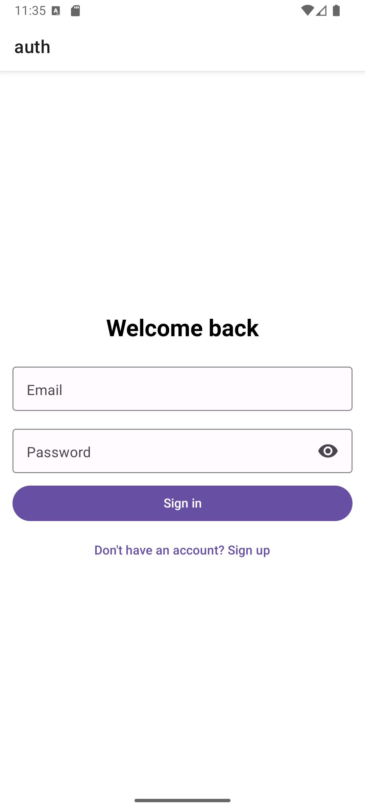
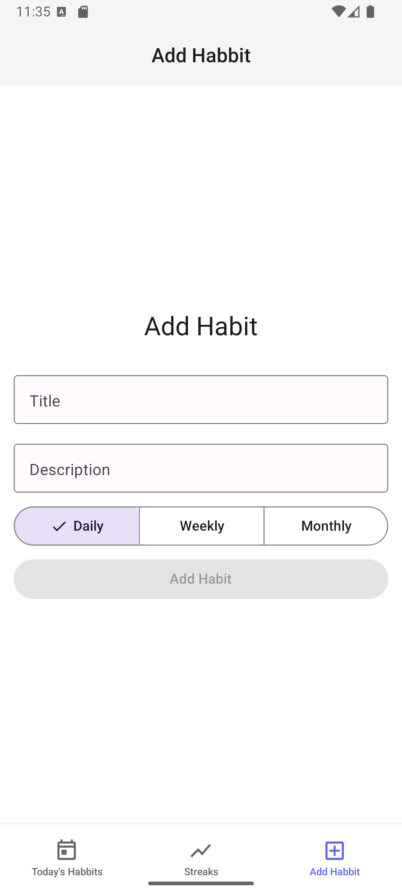
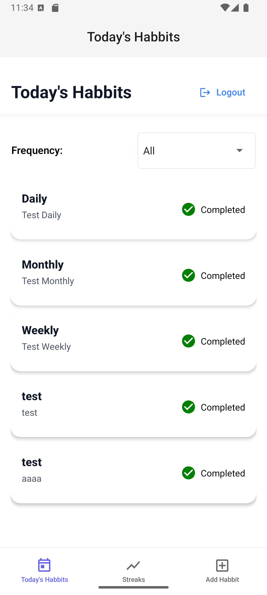
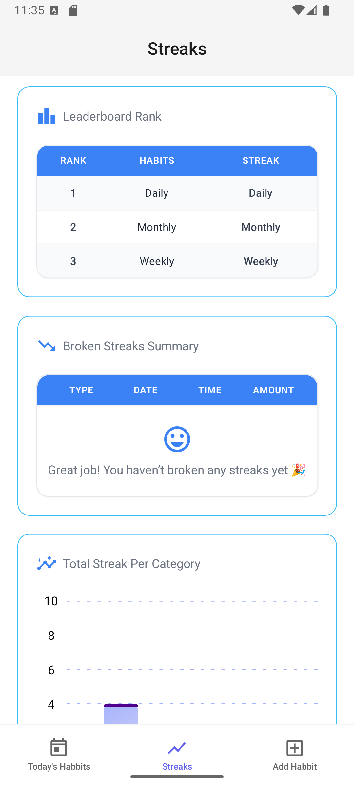

# Habit Tracker App

Aplikasi mobile Habit Tracker dibuat menggunakan React Native, Expo, Tailwind CSS, Appwrite sebagai backend, dan react-native-gifted-charts untuk visualisasi data.

Aplikasi ini dibuat sebagai portfolio pribadi sekaligus media belajar deployment aplikasi mobile.

## Fitur Utama

-   Menambahkan habit dengan frekuensi daily, weekly, dan monthly
-   Menandai habit sebagai selesai sesuai frekuensi
-   Submit tugas habit berdasarkan frekuensi
-   Analisis habit berupa leaderboard rank, broken habits, dan total streak per kategori

## Struktur Folder

```bash
habbit-tracker-app/
 ├─ .expo/
 ├─ .vscode/
 ├─ app/
 ├─ app-example/
 ├─ assets/
 ├─ components/
 ├─ data/
 ├─ hooks/
 ├─ lib/
 ├─ node_modules/
 ├─ services/
 ├─ types/
 └─ utils/
```

## Setup & Instalasi

### Prasyarat

-   Node.js dan pnpm sudah terinstall
-   Expo CLI terinstall (pnpm add -g expo-cli atau npm install -g expo-cli)
-   Akun Appwrite dan project Appwrite sudah dibuat
-   Variabel environment Appwrite sudah disiapkan (lihat bagian Environment Variables)

## Langkah Instalasi

1. Clone repository
    ```bash
    git clone <repo-url>
    cd habbits-tracker
    ```
2. Install dependencies
    ```bash
    pnpm install
    ```
3. Buat file .env di root project dan isi variabel berikut (sesuaikan dengan project Appwrite kamu):
    ```js
    EXPO_PUBLIC_APPWRITE_PROJECT_ID=2D41DA98.........
    EXPO_PUBLIC_APPWRITE_PROJECT_NAME="Habbit-Tracker-App"
    EXPO_PUBLIC_APPWRITE_ENDPOINT=https://...
    EXPO_PUBLIC_APPWRITE_PLATFORM=co...
    EXPO_PUBLIC_APPWRITE_DATABASE_ID=253D9........
    EXPO_PUBLIC_APPWRITE_COLLECTION_ID="habbits"
    EXPO_PUBLIC_APPWRITE_COMPLETIONS_COLLECTION_ID="habbit_completions"
    ```
4. Jalankan aplikasi
    ```bash
    pnpm start:clear
    ```

## Tampilan Aplikasi

### Autentikasi

<div style="text-align: center;">

</div> <br />

- `AuthScreen` untuk login dan register menggunakan hook `useAuthContext`
- Form input dengan `react-hook-form`
- Switch mode Sign In / Sign Up

### Manajemen Habit

<div style="text-align: center;">

</div> <br />

- `AddHabitScreen` untuk menambah habit dengan validasi form
- Hook `useHabbitScreen` mengatur logic form dan submit

### Daftar Habit

<div style="text-align: center;">

</div> <br />

- `Index` screen menampilkan daftar habit dengan fitur swipe untuk hapus dan tandai selesai
- Filter habit berdasarkan frekuensi
- UI menggunakan komponen `HabbitsCard`

### Analitik & Statistik

<div style="text-align: center;">
  
</div> <br />

- `StreaksScreen` menampilkan leaderboard, broken habits, dan total streak per kategori menggunakan `BarChartCategory` dari gifted-charts
- Data diambil dari context `useAuthContext`
